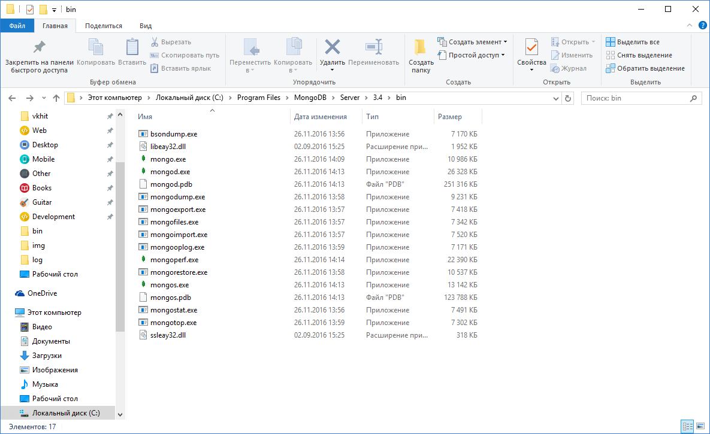
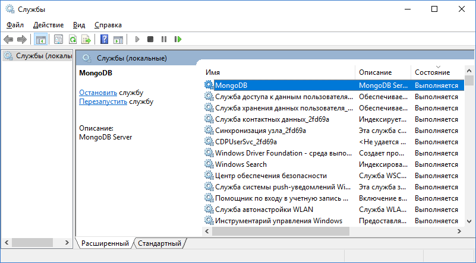
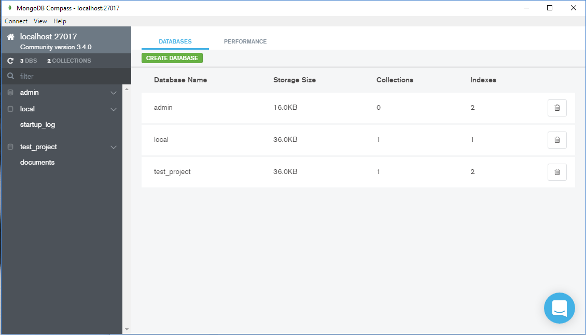
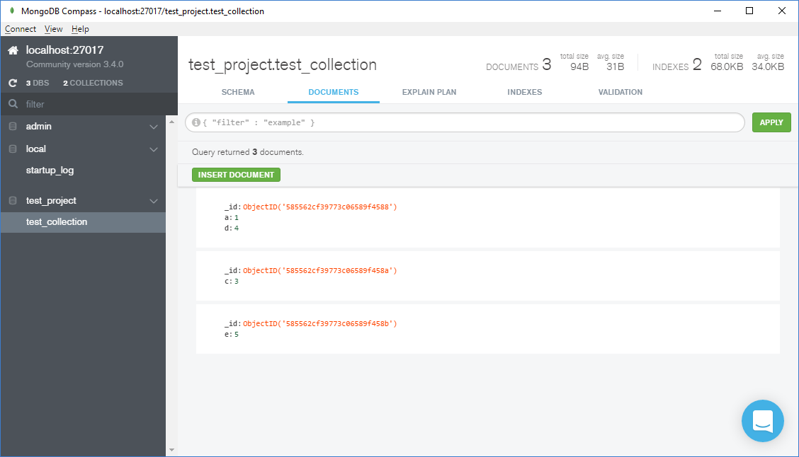
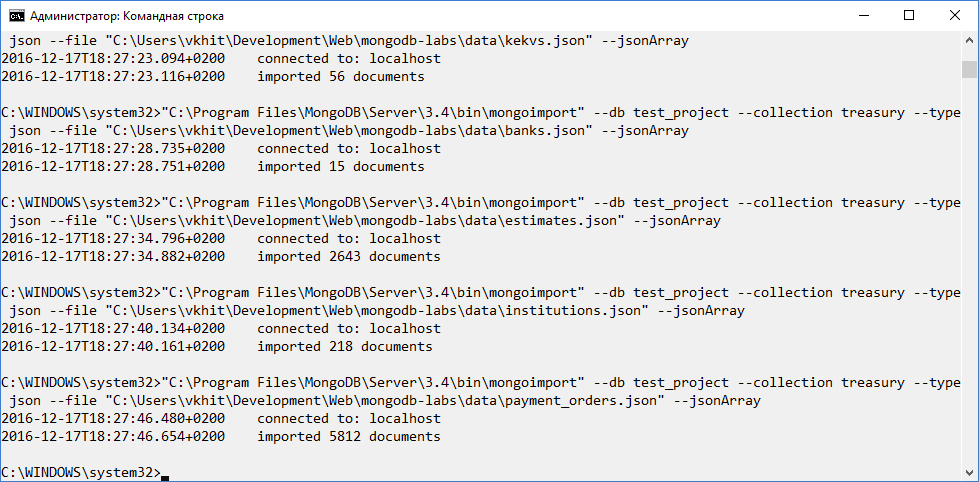

# Лабораторная работа №10
## Установка MongoDB и заполнение тестовыми данными

1. Установил MongoDB 3.4.0 2008R2Plus SSL (64 bit), скачав его [отсюда](https://www.mongodb.com/download-center#community).

2. Следуя [инструкциям](https://docs.mongodb.com/manual/tutorial/install-mongodb-on-windows), настроил сервер *mongod.exe* как сервис – теперь он работает в фоновом режиме и может обслуживать клиентские подключения в любое время.

3. Скачал и установил клиентское приложение MongoDB Compass. Создал новое соединение *local*.

4. Используя [гайд](http://mongodb.github.io/node-mongodb-native/2.2/quick-start), написал модуль (см. файл *crud-functions.js*), который предоставляет базовый интерфейс для совершения CRUD-операций над базой данных.
5. Создал скрипт, который использует все функции в этом модуле. Действия, которые выполняет скрипт:
  1. Устанавливает соединение с сервером.
  2. Создаёт 4 документа: { a: 1 }, { b: 2 }, { c: 3 }, { e: 5 }
  3. Создаёт индекс по документам с { a: 1 }
  4. Обновляет первый документ { a: 1 }, добавляя в него { d: 4 }
  5. Находит документы с { a: 1 }
  6. Удаляет первый документ с { b: 2 }
  7. Закрывает соединение с сервером.

6. Экспортировал данные из базы данных для курсовой работы в формате JSON (см. data/).
7. Импортировал данные в MongoDB с помощью инструмента *mongoimport*.

