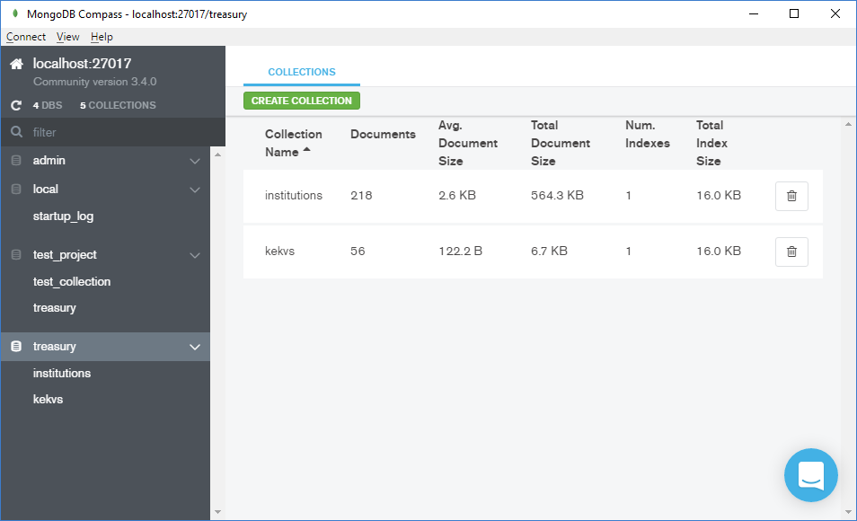

# Лабораторная работа №11
## Проектирование и использование MongoDB

1. Проанализировал предметную область "Казначейство" и спроектировал модели документов для нереляционной бд.
2. Написал скрипты, который из данных реляционного типа создаёт данные нереляционного (scripts/)
3. Заполнил MongoDB этими данными.

